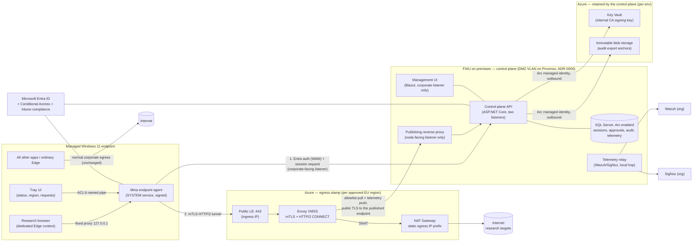

# Architecture

Status: **Approved direction (D-01…D-04, 2026-08-31), amended by ADR-0006 (D-16…D-18,
2026-09-01)** — implementation may proceed through M0–M3 and the on-premises rows of M4; the steering design remains
conditional on the M1-5 verification register (§13), and the open decisions in
`docs/PHASE0_DECISIONS.md` gate their referenced milestones.
Date: 2026-08-31, revised 2026-09-02 for ADR-0006

The approved choices: steering/transport per **ADR-0001** (Option C, variant C2, mTLS HTTP/2
transport), URL telemetry per **ADR-0002** (Option 1, hostname-at-egress, no TLS interception),
sensitive sessions per **ADR-0003**, .NET stack per **ADR-0004**, and a **hybrid hosting model per
ADR-0006**: the control plane on the FIAU Proxmox cluster, the egress stamps in Azure, and only Key
Vault and immutable blob storage still used from Azure by the control plane. ADR-0005 (telemetry over
the Check Point tunnel) is superseded by ADR-0006 and retained for the record only.

## 1. Objective

Give authorised FIAU analysts a governed research-browsing path from Intune-managed Windows 11
endpoints whose public egress uses approved Azure EU addresses, while every other application on
the endpoint keeps ordinary corporate routing. Controlled attribution separation with full
governance — not anonymity, not a VPN into the corporate network, never an open proxy.

## 2. Architecture summary



Two planes, deliberately separated and, since ADR-0006, hosted in different places:

- **Control plane** (one per environment, on the FIAU Proxmox cluster): session issuance, policy,
  approvals, audit store, management UI, internal CA front-end, telemetry forwarding. Never carries
  research traffic. Uses two Azure services outbound — Key Vault for the CA signing key and immutable
  blob storage for audit anchors — and nothing else in Azure.
- **Egress data plane** (one Azure stamp per approved region): authenticated proxy nodes behind a
  public ingress IP, SNATing to dedicated static egress IPs. Never stores governance state;
  holds only ephemeral session allowlists pulled from the control plane's published endpoint.

The planes meet at exactly one internet-facing endpoint on each side: the stamp's ingress IP, used
only by the endpoint agent's mTLS tunnel, and the control plane's published node-facing listener,
used only by the stamps' sidecars. Neither plane has a routed path to the other or to corporate
networks.

## 3. Components

### 3.1 Endpoint (Intune-managed)

| Component | Form | Role |
|---|---|---|
| Endpoint agent | .NET Worker Service, runs as SYSTEM, Authenticode-signed, Intune Win32 app | Entra auth via WAM broker; session establishment/renewal; loopback proxy; mTLS tunnel client; WFP enforcement rules (variant C2); research-browser launch; local tamper monitoring |
| Tray/status UI | Per-user WPF app (`Mina.EndpointAgent.Tray`, **built**) | FR-006: protected/unprotected state, selected region, logging mode; region selection; sensitive-session request; talks to agent over named pipe ACL'd to the interactive user |
| Research browser | Dedicated Edge context per ADR-0001 C-enf decision (recommended: distinct-image-path Edge + dedicated user-data-dir) | The only thing that uses research egress |
| Edge integration | Shortcut/launch config + hardening flags (+ policies where instance-scoping allows) | Locks proxy, disables QUIC/DoH, forces WebRTC proxy behaviour for the research instance |

Endpoint enforcement design (variant C2, recommended):

1. Agent installs WFP rules for the research browser image path: **permit** loopback to the
   agent's proxy port; **block** all other outbound IPv4 and IPv6, including UDP/53, DoH to
   arbitrary resolvers, and WebRTC UDP. Rules exist whenever the agent is installed — not just
   during sessions — so a manually launched research browser has no network path at all.
2. The Mina shortcut starts the tray UI → agent authenticates and establishes the session →
   agent spawns the research browser with locked flags (`--user-data-dir`, `--proxy-server=127.0.0.1:<port>`,
   QUIC/DoH/WebRTC hardening flags; exact names pinned in Phase 1).

   > **Open question (raised building the tray, 2026-09-01).** The agent runs as SYSTEM in session
   > 0, and a service cannot spawn a process onto the interactive desktop without duplicating the
   > logged-on user's token (`WTSQueryUserToken` → `DuplicateTokenEx` → `CreateProcessAsUser`).
   > Three ways out, and the choice is security-relevant enough not to be made in passing:
   >
   > - **(a) Agent spawns via token duplication** — keeps the flag set in signed SYSTEM code where
   >   a user-mode process cannot influence it, at the cost of a privileged token operation in the
   >   agent.
   > - **(b) Tray spawns it** — no privileged token work, and the flags still live in signed code
   >   the analyst cannot edit, but a tampered tray could launch the research browser image with a
   >   different command line. WFP and the proxy peer check still bound what that browser reaches,
   >   so the flags are defence in depth either way.
   > - **(c) The Intune-deployed shortcut spawns it** with the flags baked in and the agent only
   >   supplying the port — which reintroduces a fixed, predictable port.
   >
   > Until this is decided, neither the agent nor the tray launches the browser, and the tray panel
   > offers no launch button. Nothing else in the tray depends on the answer.
3. The loopback proxy accepts connections only from the expected browser process (peer PID →
   image path + user-data-dir check) and only while an authenticated session exists. Otherwise
   it refuses — combined with fixed-proxy-no-fallback this is the fail-closed core (FR-007).
4. Named-pipe IPC: SDDL restricted (SYSTEM + interactive user read/write); all
   privileged operations validated server-side in the agent; no secrets in user-readable config
   (SR-006). **Built** — see `endpoint-agent/README.md` for the DACL, the `FirstPipeInstance`
   squat check, the frame and idle bounds, and which operations are re-validated.
5. Agent self-monitoring: reports tamper indicators (WFP rule removal attempts, unexpected
   research-browser instances, proxy-port probes from foreign processes) as security events.

### 3.2 Control plane (on premises, FIAU Proxmox cluster — ADR-0006)

Since ADR-0006 the control plane runs on the FIAU's own infrastructure, in a **dedicated DMZ VLAN**
rather than on the corporate LAN. That placement is a control, not a detail: one of its listeners is
published to the internet so the Azure egress nodes can reach it, so the segment is treated as
internet-exposed and is firewalled from the corporate LAN accordingly. Nodes gain no route into
corporate networks — they call a public endpoint, exactly as they called an Azure one.

- **Control-plane API** (ASP.NET Core on Linux, Kestrel behind the DMZ reverse proxy): session
  issuance/renewal/termination; region policy; sensitive-session state machine; internal-CA
  certificate issuance (signing key in Key Vault, never exported); node config distribution; audit
  event write path. **Two listeners with different exposure** (ADR-0006 constraint 3): the
  node-facing listener carries only the allowlist and telemetry-ingest endpoints and is the only one
  published to the internet; the analyst session API, the suppression workflow, the audit read API
  and every administrative endpoint bind a corporate-facing listener. The discriminator is the local
  port the TCP connection was accepted on, which no client header and no proxy rule can influence,
  and the check runs before authentication so an endpoint on the wrong listener answers a plain 404
  rather than a challenge that would confirm it exists elsewhere. Ports are configured under
  `Mina:Hosting:Listeners`; a host that is not Development refuses to start without both.
- **Management UI** (Blazor static server rendering, same host family): approvals, session/health/
  audit visibility, region policy administration. Entra sign-in, app-role authorisation,
  Conditional Access (compliant device) enforced at the Entra layer. No longer internet-reachable,
  which removes it from the D-07 ingress rationale.
- **SQL Server on Proxmox, Azure Arc-enabled** (D-17): sessions, approvals, policy, audit events,
  hostname telemetry (separate schema; see §10). Arc enablement is what keeps Entra authentication
  and therefore the "no client secrets" property; encryption at rest and backup are now FIAU's to
  configure rather than platform-managed.
- **Azure Key Vault** (remains in Azure, D-18): internal CA key and Envoy server certificate
  material. Reached outbound from the control-plane hosts using their Arc-enabled server managed
  identity, so no credential is stored on premises either.
- **Azure immutable blob storage** (remains in Azure, D-18): audit export anchors. On-premises
  storage the same administrator controls cannot make an anchor tamper-evident.

Both hosts must supply what App Service used to: forwarded-header handling behind the reverse
proxy, a persisted Data Protection key ring, and configuration that is verified at startup — a
missing connection string now refuses the host rather than selecting an in-memory store.
- **Telemetry relay**: forwards audit/security events to Wazuh and OTLP telemetry to SigNoz.
  Both receivers are on the FIAU network, so delivery is a local hop (§10.3); ADR-0005's tunnel
  path is superseded.

### 3.3 Egress data plane (Azure, per approved region)

- **Public Standard Load Balancer** with one static **ingress** public IP, TCP 443 only.
  Optionally source-restricted to FIAU's corporate egress CIDRs (decision D-07).
- **Envoy on Linux VMSS** (2+ instances): terminates mTLS (platform internal CA; the client
  certificate must chain to that CA and be unexpired), then consults the node sidecar over
  `ext_authz` before admitting the tunnel — a certificate alone is necessary but no longer
  sufficient; see the revocation note in §4 (D-19, M4-11) — terminates HTTP/2, serves CONNECT,
  applies the destination deny-list for private and link-local space, opens upstream connections,
  and emits per-connection hostname telemetry. Suppression is applied by the sidecar and the
  control plane, not by Envoy, which has no per-session suppression policy of its own.
  Hardened minimal image, rebuilt from IaC/pipeline, no inbound management from the internet
  (Azure-native management path only).
- **NAT Gateway** with a static public IP prefix (e.g. /30): the **egress** identity analysts
  appear from. Deliberately distinct from the ingress IP.
- **Node sidecar** (.NET): pulls the session view (which sessions this region serves, and which are
  suppressed) from the control-plane API every ~15 s using its managed identity, and answers Envoy's
  `ext_authz` admission check over a Unix socket for every CONNECT — a session issued since the last
  pull is covered by a bounded refresh-on-miss rather than waiting for the next poll. Admission is
  now load-bearing: since D-19 (2026-09-02, M4-11) a node whose sidecar cannot be reached or whose
  session view is too old to trust refuses every tunnel, and the load balancer probes the sidecar's
  health through Envoy rather than TCP on the tunnel port for exactly that reason (§9). It ships
  Envoy telemetry to the control plane/relay and runs the Wazuh agent.
- **NSG/route posture**: outbound to Internet allowed; outbound to RFC1918, Azure service tags
  for corp-peered ranges, and the corporate public CIDRs **denied**; no VNet peering, no gateway,
  no UDR toward anything. The control plane is reached at its published public endpoint over TLS
  like any other internet destination (ADR-0006 constraint 5), so there is no control-plane VNet
  to peer with and the blanket deny has no exceptions.

## 4. Identity and access

- **Entra applications**: one enterprise app for the platform with app roles
  `Mina.Analyst`, `Mina.Approver`, `Mina.Admin`, group-assigned. Endpoint agent registered as a
  public client using the WAM broker (silent SSO from the existing Windows session — FR-002);
  management UI as a confidential client; egress node sidecars use the VMSS managed identity, and
  the on-premises control-plane hosts use their Azure Arc system-assigned managed identity for
  SQL Server (D-17), Key Vault and blob storage (D-18) — no client secrets anywhere in the product.
- **Conditional Access**: policy targeting the Mina app requiring compliant (Intune) device and
  the org's MFA baseline. Device identity/compliance is evaluated at token issuance via the
  WAM/PRT flow; the control plane records the device ID per session (FR-003, SR-007).

  What the control plane can and cannot see, stated exactly, because the distinction has been
  misread before: an Entra access token carries **no Intune compliance claim**. A `deviceid` claim
  proves the device is Entra-*registered* and that the token came from a device-bound flow — a
  registered device that is actively failing its compliance policy emits the same claim. The
  control plane therefore refuses a token that is not device-bound (`DeviceNotBound`), which is a
  real control but not a compliance check.

  Compliance is proved by **Conditional Access authentication context**. An auth context (say `c1`)
  is defined in the tenant, a CA policy granting on "device marked as compliant" is bound to it, and
  `Mina:Session:RequiredAuthContextId` is set to that value. Entra then emits the id in the token's
  `acrs` claim only when that policy was actually satisfied, and the control plane requires it —
  answering `401` with a `WWW-Authenticate: Bearer error="insufficient_claims"` challenge otherwise,
  so a compliant device steps up silently from its PRT. This is fail-closed and self-verifying in a
  way the `deviceid` check is not: delete, mis-scope or add an exclusion to the policy and the claim
  stops arriving and sessions stop being issued.

  A challenge is a protocol step, not a refusal, and it is recorded as an `authz_denied` audit event
  with reason `AuthenticationContextRequired` like any other denial. Operators and anyone reading
  the trail should expect a baseline of these once the requirement is on: a device that cannot
  comply shows up as challenges that never convert into an established session, not as the presence
  of challenges. Over-recording is the deliberate direction for the audit trail, so the event is
  kept rather than suppressed.

  **Deployment prerequisite.** The setting is empty by default because it has a tenant-side
  precondition (the auth context and the policy bound to it, backlog M2-1). Setting it before that
  exists refuses every session — the safe direction, but a deployment step rather than a default.
  The endpoint agent must also answer the challenge by re-acquiring with `.WithClaims(...)`; the
  current agent uses a configured-token stand-in and cannot, so this lands with the WAM broker in
  M2-4. Until both are in place, compliance is enforced by Conditional Access alone and the
  platform cannot detect a missing policy.
- **Session lease model**: Entra access tokens are minutes-to-an-hour artefacts; research
  sessions need tighter control. The control plane therefore issues its own **session-bound
  client certificate** (TTL ≈ 60 min, renewable only with a fresh valid Entra token) plus a
  session record with state. Revocation = stop renewing **and** the node stops admitting new
  tunnels for the session as soon as its view no longer lists it (D-19, M4-11): a certificate
  chaining to the internal CA is necessary to open a tunnel but no longer sufficient, since the
  node's sidecar (`ext_authz`) refuses any session the control plane does not currently list.
  This bounds *new* admissions to roughly the sidecar's refresh interval (default 15 s), not the
  certificate's remaining TTL — a certificate for a session issued since the last refresh is
  covered by a bounded refresh-on-miss rather than waiting for the next poll. **An already-open
  tunnel is not affected**: Envoy does not re-run admission on an established connection, so a
  long-lived tunnel opened before revocation keeps carrying traffic until it closes on its own —
  see the accepted limitation recorded at D-19. No CAE dependency.
- No local passwords, no separate credential store, break-glass excepted (§12).

```mermaid
sequenceDiagram
    participant U as Analyst
    participant T as Tray UI
    participant A as Agent (SYSTEM)
    participant E as Entra ID (+CA)
    participant C as Control plane
    participant X as Egress node (Envoy)
    U->>T: Launch Mina, pick approved region
    T->>A: Start session (named pipe)
    A->>E: Silent token via WAM broker (existing session)
    E-->>A: Access token (user, roles, device claims)
    A->>C: POST /sessions {region, CSR} + token
    C->>C: Authorise: role, region approved, device-bound token (+ CA auth context when configured)
    C-->>A: Session ID + client cert (60 min) + egress endpoint
    X->>C: Pull session view (~15 s; admission + suppression, D-19)
    C->>C: Audit: session_started → Wazuh
    A->>X: mTLS HTTP/2 tunnel (client cert)
    A->>A: Open loopback proxy, then spawn research browser
    loop while browsing
        A->>C: Renew (fresh WAM token) before cert expiry
    end
    U->>T: End session (or browser closed / tunnel lost)
    A->>C: DELETE /sessions/{id}
    C->>X: Remove session → connections dropped
```

## 5. Traffic path and fail-closed behaviour

Research request path: browser → `CONNECT host:443` to loopback proxy → agent multiplexes over
the mTLS HTTP/2 session → Envoy authorises the session, resolves the hostname via the Azure
resolver, connects out via NAT Gateway → target sees the approved egress IP (AC-003).

Fail-closed (FR-007, AC-004) is layered — every failure lands on "no traffic", never "wrong path":

| Failure | Behaviour |
|---|---|
| Tunnel drops / egress unreachable | Agent closes the loopback listener; browser gets proxy errors; fixed proxy config cannot fall back to DIRECT; agent retries and surfaces state in tray |
| Agent killed / crashes | Loopback proxy gone ⇒ browser has no path; C2 WFP rules persist independently of the agent process, so even flag-stripped launches stay contained |
| Session revoked / expired | Control plane stops renewal, and the node's sidecar stops admitting *new* tunnels for the session once its view no longer lists it — within one refresh interval (~15 s), or immediately for a session that was never listed (D-19, M4-11). A tunnel already open when the session is revoked is not affected: Envoy does not re-run admission on an established connection, so it keeps carrying traffic until it closes on its own (accepted limitation, D-19). Loopback closes when the agent's renewal is refused |
| Control plane down | Nodes fail closed once their session view exceeds `AdmissionMaxViewAge` (5 min default) — refusing *new* tunnels for sessions they still list, not only ones dropped from it — sooner than the ~60 min this superseded, because admission no longer rests on certificate validity alone (D-19). Existing open tunnels are unaffected by this row for the same reason as above |
| Research browser launched outside the agent | C2: WFP allows only loopback ⇒ nothing works until a session exists; C1 fallback: detective controls only (ADR-0001) |

## 6. Leak controls

| Vector | Control | Verified by |
|---|---|---|
| DNS | Proxied requests carry hostnames; resolution happens at egress via Azure resolver; research browser's direct UDP/TCP 53 and DoH blocked by WFP (C2) and DoH disabled by flags; corporate resolvers never see research names | DNS canary test (authoritative-server observation), AC-005 |
| Fallback to corporate egress | Fixed proxy, no DIRECT; loopback closed unless session live; WFP default-block for research binary | Kill-tunnel e2e test, AC-004 |
| IPv6 | No local resolution (no AAAA path); WFP blocks direct IPv6 from research binary; egress is IPv4-only at MVP (NAT GW limitation — AAAA-only sites unreachable; accepted, documented) | Dual-stack leak tests, AC-006 |
| WebRTC | Browser IP-handling forced to proxy-only/non-proxied-UDP-disabled for the research instance; C2 WFP blocks its UDP anyway; mDNS ICE obfuscation remains default | WebRTC harness page, AC-007 |
| QUIC/HTTP3 | Disabled for the research instance (flag/policy); WFP blocks UDP/443 regardless | Network capture during e2e, AC-006/007 |
| Ordinary apps captured by mistake | Only the research image path has WFP rules; only the research instance has the proxy config; nothing else references the agent | Negative-path test: normal Edge/apps exit via corp IP, AC-002 |
| Open proxy | Envoy requires platform mTLS (a client certificate chaining to the internal CA) **and** the node sidecar admitting the session (D-19, M4-11); LB exposes 443 only; optional source-CIDR restriction | External open-proxy scan, AC-016; real-Envoy client-authentication and session-admission tests |
| Egress → corp | NSG/route denies RFC1918 + corp CIDRs from egress subnets; no peering to corp | Automated reachability probes from nodes, AC-017 |

## 7. Session and sensitive-session lifecycle

Session states: `ESTABLISHING → ACTIVE → (RENEWING) → ENDED | REVOKED | EXPIRED`.
Sensitive-session overlay per ADR-0003:

```mermaid
stateDiagram-v2
    [*] --> NORMAL
    NORMAL --> REQUESTED: analyst request (justification + duration)
    REQUESTED --> DENIED: approver denies
    REQUESTED --> APPROVED: approver (≠ requester) approves, TTL set
    REQUESTED --> CANCELLED: analyst withdraws
    APPROVED --> ACTIVE_SUPPRESSED: control plane activates; nodes pick the flag up on next pull
    ACTIVE_SUPPRESSED --> ENDED_EXPIRED: TTL expiry ⇒ session terminated (D-06a: activated only)
    ACTIVE_SUPPRESSED --> ENDED_EXPIRED: analyst ends early
    DENIED --> NORMAL
    CANCELLED --> NORMAL
    ENDED_EXPIRED --> NORMAL: analyst may start a fresh normal session
```



All transitions are control-plane operations, audited, Wazuh-forwarded. During
`ACTIVE_SUPPRESSED`, egress nodes record no hostnames for the session — only
suppression markers, aggregate counters, and the mandatory metadata set (ADR-0003).

## 8. Azure resource design

Environments `dev`, `test`, `prod` as separate Terraform states (and ideally subscriptions);
naming `rg-mina-<plane>-<env>[-<region>]`. The on-premises plane has its own state per environment
(`environments/dev-onprem`, module `control-plane-onprem`) against the Proxmox API, with the API
token taken from the environment so it never enters a variable, a tfvars file or state.

**Control plane — on premises (per env), FIAU Proxmox cluster (ADR-0006):**

| Resource | Notes |
|---|---|
| DMZ VLAN | Dedicated segment, firewalled from the corporate LAN |
| Publishing reverse proxy VM | Publishes the node-facing listener only; no server block exists for the management port |
| Application VM (API + portal) | Two listeners on separate ports; host firewall admits the node port from the proxy only, the management port from corporate ranges only |
| SQL Server VM (Azure Arc-enabled) | Sessions, approvals, audit and telemetry schemas. Arc is what keeps Entra authentication with no stored credential (D-17) |
| Telemetry relay | Co-located with Wazuh and SigNoz, so delivery is a local hop; the Check Point tunnel is not used |

**Control plane — what remains in Azure (per env):**

| Resource | Notes |
|---|---|
| Resource group `rg-mina-<env>-cp` | |
| Key Vault (RBAC, purge protection) | Internal CA key (non-exportable). Premium/HSM in production; reached outbound from the Arc-enabled hosts |
| Storage account (immutable/WORM container) | Periodic signed audit export for tamper evidence. Locked immutability in production — Unlocked anchors nothing |
| Log Analytics workspace | CA key use (Key Vault AuditEvent) and audit-anchor access (StorageRead/Write/Delete); optional subscription Activity Log export for the ARM operations that would remove tamper evidence. **It currently sits in the subscription it watches**, so it shares a blast radius with the resources it protects — moving it to a separate subscription is a production gate (M4-28) |

**Egress stamp (per approved region, per env):**

| Resource | Notes |
|---|---|
| Resource group `rg-mina-egress-<env>-<region>` | |
| VNet + egress subnet + NSG | Outbound deny RFC1918 + corp CIDRs; inbound 443 only |
| Standard public LB + 1 static ingress IP | TCP 443 → Envoy |
| Linux VMSS (2 × D2as_v5; dev: 1 × B2s) | Hardened image, Envoy + sidecar + Wazuh agent; no public per-instance IPs |
| NAT Gateway + public IP prefix /30 | Static approved egress IPs; headroom for post-MVP rotation |

Approved region list (D-08, decided 2026-08-31): `westeurope`, `northeurope`,
`germanywestcentral`, `francecentral`. Analysts can select only regions with an **active**
stamp: dev/MVP runs one (`westeurope`); production launches with **one active stamp** (D-11),
with further approved regions activated on demand (~€240/mo each, COST_MODEL). Production
region selection is unaffected by D-08a below.

`spaincentral` is additionally approved **for the dev/PoC stamp only** (D-08a, decided
2026-09-04): the dev subscription's offer type blocks every D-08 region for mainstream VM
families, and spaincentral is where a same-class replacement was confirmed available. Not a
candidate for production.

## 9. Capacity and availability

50 concurrent analysts browsing is small: plan ~2–10 Mbps sustained aggregate per region with
bursts; 2 × D2as_v5 Envoy nodes are comfortably over-provisioned (headroom + N+1). SQL Server on a
modest Proxmox VM handles the write rates (hostname telemetry est. < 10 events/s aggregate).
Scale-out is VMSS instance count; scale-up is SKU. NAT GW SNAT ports are a non-issue at this
scale (64k/IP × 4 IPs).

Availability posture per D-11 (2026-08-31): production launches with a single active egress
region, so a full region outage pauses research browsing (fail-closed — never a leak) until
another approved region's stamp is activated from IaC. This is an accepted availability
trade-off, revisited when usage justifies a standing second stamp; node-level HA within the
stamp (2+ instances, zones optional) still applies in production.

Control-plane availability is the FIAU's to provide since ADR-0006: Proxmox cluster HA, SQL Server
backup/restore and the published endpoint's uptime replace what App Service and Azure SQL managed.
The on-premises environment is one of each host today (M4-15); running two instances is a design
question in its own right (ADR-0006, "More than one instance") and the background-service lease is
backlog M4-23. An outage stops session issuance and renewal within one lease period — the platform
failing closed — and `docs/OPERATIONS.md` lists the runbooks. Since D-19 (M4-11), node-side
admission fails closed sooner than that: a node that cannot reach the control plane stops admitting
*new* tunnels once its session view exceeds `AdmissionMaxViewAge` (5 min default), tightening the
partition case — a control plane reachable to admins but not to nodes — without changing the
overall lease-bounded horizon for issuance and renewal.

## 10. Audit and telemetry

### 10.1 Stores and flows

- **Audit events** (governance: auth results, session lifecycle, approvals, policy/admin
  actions, break-glass): written synchronously by the control plane to SQL, exported to the
  WORM container on schedule, forwarded to **Wazuh**. Wazuh receives *security/audit* events
  only — never URL/hostname content.
- **Hostname telemetry** (ADR-0002 Option 1): Envoy → sidecar → control-plane ingest →
  SQL telemetry schema. Correlated with user/device/session (AC-009). Retention configurable,
  TBD by DPO (D-09). Suppression enforced at the node (§7).
- **Operational telemetry**: OpenTelemetry from control plane, agent (non-sensitive), and
  nodes → **SigNoz** via OTLP. A scrub processor strips URLs/hostnames from anything bound for
  SigNoz (AC-014); dashboards per `docs/OPERATIONS.md`.

### 10.2 Event schemas

Defined in `docs/EVENT_SCHEMAS.md` (envelope, event catalogue, severities, Wazuh mapping,
SigNoz metric/trace inventory).

### 10.3 Reaching org-hosted Wazuh/SigNoz (ADR-0006 — the problem dissolved)

The relay now runs on premises alongside Wazuh and SigNoz, so delivery is a **local hop inside the
FIAU network**. No tunnel, no cross-boundary routing, and no Check Point rule to scope: ADR-0005
solved the problem of reaching org-hosted receivers from Azure, and the control plane moving on
premises removed that problem rather than changing it. D-05's open precondition — network-team
confirmation of Check Point rule scoping — accordingly leaves the critical path, and Mina no longer
depends on the tunnel at all.

Egress nodes are unchanged: they deliver telemetry only to the control plane over public TLS, now to
the endpoint published from the FIAU DMZ rather than an Azure one. Their VNets remain unpeered and
unrouted toward corporate space, so the "no route from research egress into corporate networks"
invariant (SR-001, CLAUDE.md #4) holds exactly as before — which is why ADR-0006 chose publishing
over the tunnel.

## 11. Network invariants → enforcement mapping

| Invariant | Enforced by |
|---|---|
| Ordinary apps never use research egress | Proxy config + WFP rules exist only for the research browser image/instance |
| Protected traffic never falls back to ordinary egress | Fixed proxy no-DIRECT; loopback gated on live session; C2 WFP default-block |
| A revoked or unknown session cannot open a new tunnel | Node-side admission (D-19, M4-11): Envoy consults the sidecar's session view for every CONNECT and refuses anything it does not currently list, bounded by the refresh interval rather than the certificate TTL. Does not close a tunnel already open at the moment of revocation — see the accepted limitation at D-19 |
| Research egress cannot reach corp/RFC1918 | Egress NSG + route deny; no peering; automated probes (AC-017). ADR-0006 kept this intact by publishing the control plane's node-facing endpoint from the FIAU DMZ rather than routing nodes over the tunnel |
| Management endpoints authenticated, and never served on the published listener | Entra + Conditional Access on UI/API; the portal, audit read and administrative endpoints bind a corporate-facing listener only, so they are unreachable from the internet even if the DMZ proxy is misconfigured (ADR-0006 constraint 1); nodes authenticate with a per-region app role |
| No public unauthenticated proxy/forwarder | mTLS-only Envoy listener; 443-only LB; optional source-CIDR allowlist; external scans (AC-016) |

## 12. Break glass (management-only)

Proposed definition (decision D-10): break glass = regaining *administrative* control of the
platform when the normal path (Entra sign-in + management UI) is unavailable. It is composed of
existing enterprise mechanisms — **no application backdoor exists**:

- Two cloud-only Entra emergency-access accounts (org standard practice), excluded from the CA
  policies that could lock admins out, credentials vaulted offline under management custody,
  sign-in monitored: any use → high-severity Wazuh event via the Entra sign-in log export
  (AC-015, SR-009).
- Azure RBAC emergency group (PIM-eligible, approval-gated) able to operate the **Azure** half of
  the platform directly (e.g. disable an egress region by stopping the VMSS/LB) when the control
  plane is down. All activity-log events for these principals → high-severity Wazuh events.
- **Gap since ADR-0006:** Azure RBAC cannot touch a Proxmox-hosted API, portal or database, so
  regaining administrative control of the on-premises plane when Entra sign-in fails has no
  mechanism yet. It needs the same shape — enterprise-standard emergency access to Proxmox and the
  SQL host under management custody, every use alerted at high severity — and is backlog M4-21. D-10
  is to be extended for it, not reinterpreted.
- Analyst-facing componentry contains no break-glass code paths, credentials, or configuration.
- Every use triggers the post-use review runbook (`docs/OPERATIONS.md`).

## 13. Phase 1 verification register

The load-bearing Windows/Edge behaviours this design assumes are listed in ADR-0001
(§ Verification register) and must be prototype-verified before ADR-0001 is Accepted. Any
failure there returns this document to Proposed for rework — do not build past it.

## 14. References

Requirements: `docs/REQUIREMENTS.md` · Threats: `docs/THREAT_MODEL.md` · Logging:
`docs/LOGGING_AND_PRIVACY.md` · Events: `docs/EVENT_SCHEMAS.md` · Cost: `docs/COST_MODEL.md` ·
Tests: `docs/TEST_STRATEGY.md` · Backlog: `docs/BACKLOG.md` · Decisions: `docs/PHASE0_DECISIONS.md`
