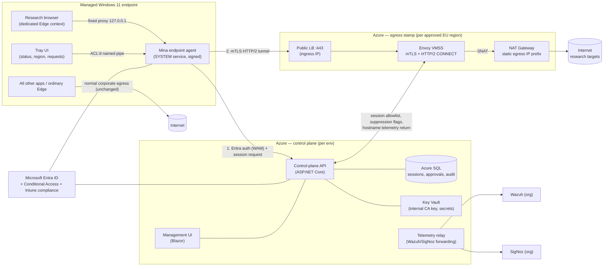
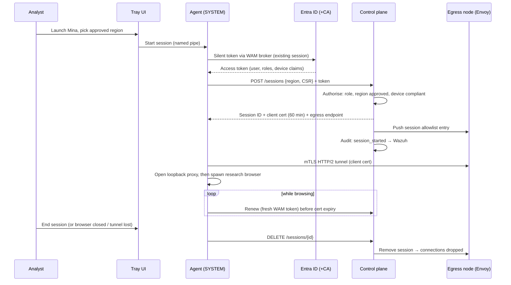
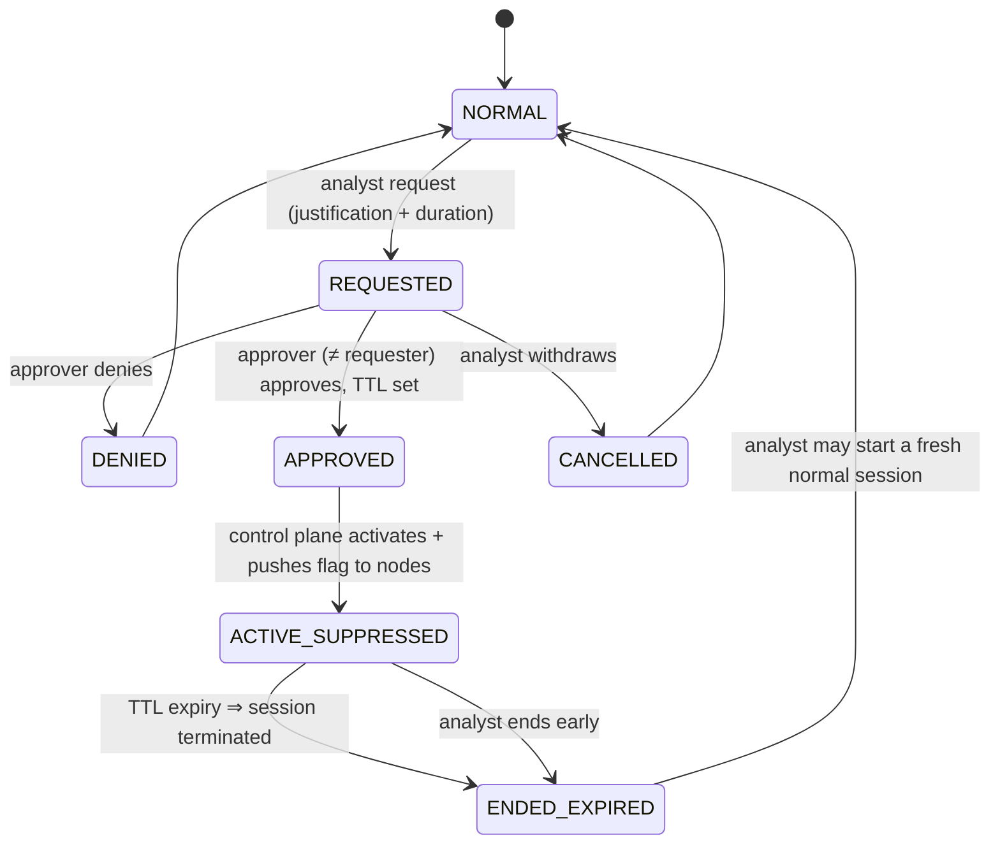

# Architecture

Status: **Approved direction (D-01…D-04, 2026-08-31)** — implementation may proceed through
M0–M2; the steering design remains conditional on the M1-5 verification register (§13), and the
open decisions in `docs/PHASE0_DECISIONS.md` gate their referenced milestones.
Date: 2026-08-31

The approved choices: steering/transport per **ADR-0001** (Option C, variant C2, mTLS HTTP/2
transport), URL telemetry per **ADR-0002** (Option 1, hostname-at-egress, no TLS interception),
sensitive sessions per **ADR-0003**, .NET stack per **ADR-0004**.

## 1. Objective

Give authorised FIAU analysts a governed research-browsing path from Intune-managed Windows 11
endpoints whose public egress uses approved Azure EU addresses, while every other application on
the endpoint keeps ordinary corporate routing. Controlled attribution separation with full
governance — not anonymity, not a VPN into the corporate network, never an open proxy.

## 2. Architecture summary

Two Azure planes, deliberately separated:

- **Control plane** (one per environment): session issuance, policy, approvals, audit store,
  management UI, internal CA, telemetry forwarding. Never carries research traffic.
- **Egress data plane** (one stamp per approved region): authenticated proxy nodes behind a
  public ingress IP, SNATing to dedicated static egress IPs. Never stores governance state;
  holds only ephemeral session allowlists pushed/pulled from the control plane.

## 3. Components

### 3.1 Endpoint (Intune-managed)

| Component | Form | Role |
|---|---|---|
| Endpoint agent | .NET Worker Service, runs as SYSTEM, Authenticode-signed, Intune Win32 app | Entra auth via WAM broker; session establishment/renewal; loopback proxy; mTLS tunnel client; WFP enforcement rules (variant C2); research-browser launch; local tamper monitoring |
| Tray/status UI | Per-user WPF/WinUI app | FR-006: protected/unprotected state, selected region, logging mode; region selection; sensitive-session request; talks to agent over named pipe ACL'd to the interactive user |
| Research browser | Dedicated Edge context per ADR-0001 C-enf decision (recommended: distinct-image-path Edge + dedicated user-data-dir) | The only thing that uses research egress |
| Edge integration | Shortcut/launch config + hardening flags (+ policies where instance-scoping allows) | Locks proxy, disables QUIC/DoH, forces WebRTC proxy behaviour for the research instance |

Endpoint enforcement design (variant C2, recommended):

1. Agent installs WFP rules for the research browser image path: **permit** loopback to the
   agent's proxy port; **block** all other outbound IPv4 and IPv6, including UDP/53, DoH to
   arbitrary resolvers, and WebRTC UDP. Rules exist whenever the agent is installed — not just
   during sessions — so a manually launched research browser has no network path at all.
2. The Mina shortcut starts the tray UI → agent authenticates and establishes the session →
   agent spawns the research browser with locked flags (`--user-data-dir`, `--proxy-server=127.0.0.1:<port>`,
   QUIC/DoH/WebRTC hardening flags; exact names pinned in Phase 1).
3. The loopback proxy accepts connections only from the expected browser process (peer PID →
   image path + user-data-dir check) and only while an authenticated session exists. Otherwise
   it refuses — combined with fixed-proxy-no-fallback this is the fail-closed core (FR-007).
4. Named-pipe IPC: SDDL restricted (SYSTEM + interactive user read/write); all
   privileged operations validated server-side in the agent; no secrets in user-readable config
   (SR-006).
5. Agent self-monitoring: reports tamper indicators (WFP rule removal attempts, unexpected
   research-browser instances, proxy-port probes from foreign processes) as security events.

### 3.2 Control plane (Azure, per environment)

- **Control-plane API** (ASP.NET Core, App Service): session issuance/renewal/termination;
  region policy; sensitive-session state machine; internal-CA certificate issuance (signing key
  in Key Vault, never exported); node config distribution; audit event write path.
- **Management UI** (Blazor Server, App Service): approvals, session/health/audit visibility,
  region policy administration. Entra sign-in, app-role authorisation, Conditional Access
  (compliant device) enforced at the Entra layer.
- **Azure SQL Database**: sessions, approvals, policy, audit events, hostname telemetry
  (separate schema; see §10). TDE at rest; private endpoint; no public access.
- **Key Vault**: internal CA key, Envoy server cert material, integration secrets. RBAC +
  managed identities only; purge protection on.
- **Telemetry relay**: forwards audit/security events to Wazuh and OTLP telemetry to SigNoz
  (network path is decision D-05, §10.3).

### 3.3 Egress data plane (Azure, per approved region)

- **Public Standard Load Balancer** with one static **ingress** public IP, TCP 443 only.
  Optionally source-restricted to FIAU's corporate egress CIDRs (decision D-07).
- **Envoy on Linux VMSS** (2+ instances): terminates mTLS (platform internal CA; client
  certificate must chain and carry a currently valid session ID), terminates HTTP/2, serves
  CONNECT, opens upstream connections, emits per-connection hostname telemetry (unless the
  session is suppression-flagged), enforces per-session policy pushed from the control plane.
  Hardened minimal image, rebuilt from IaC/pipeline, no inbound management from the internet
  (Azure-native management path only).
- **NAT Gateway** with a static public IP prefix (e.g. /30): the **egress** identity analysts
  appear from. Deliberately distinct from the ingress IP.
- **Node sidecar** (small, may be .NET): pulls session allowlist/suppression flags from the
  control-plane API every ~30 s using its managed identity (also push-notified for fast
  revocation), ships Envoy telemetry to the control plane/relay, runs the Wazuh agent.
- **NSG/route posture**: outbound to Internet allowed; outbound to RFC1918, Azure service tags
  for corp-peered ranges, and the corporate public CIDRs **denied**; no VNet peering to
  anything except (optionally) the control-plane VNet for config — and even that is
  API-over-TLS, not routed reachability, if D-05 resolves to relay-in-control-plane.

## 4. Identity and access

- **Entra applications**: one enterprise app for the platform with app roles
  `Mina.Analyst`, `Mina.Approver`, `Mina.Admin`, group-assigned. Endpoint agent registered as a
  public client using the WAM broker (silent SSO from the existing Windows session — FR-002);
  management UI as a confidential client; egress node sidecars and control plane use Azure
  managed identities (no client secrets anywhere in the product).
- **Conditional Access**: policy targeting the Mina app requiring compliant (Intune) device and
  the org's MFA baseline. Device identity/compliance is evaluated at token issuance via the
  WAM/PRT flow; the control plane additionally validates the device claims in the token and
  records the device ID per session (FR-003, SR-007).
- **Session lease model**: Entra access tokens are minutes-to-an-hour artefacts; research
  sessions need tighter control. The control plane therefore issues its own **session-bound
  client certificate** (TTL ≈ 60 min, renewable only with a fresh valid Entra token) plus a
  session record with state. Revocation = stop renewing + push removal to nodes (effective in
  seconds via the push channel, ≤30 s via pull). No CAE dependency.
- No local passwords, no separate credential store, break-glass excepted (§12).

## 5. Traffic path and fail-closed behaviour

Research request path: browser → `CONNECT host:443` to loopback proxy → agent multiplexes over
the mTLS HTTP/2 session → Envoy authorises the session, resolves the hostname via the Azure
resolver, connects out via NAT Gateway → target sees the approved egress IP (AC-003).

Fail-closed (FR-007, AC-004) is layered — every failure lands on "no traffic", never "wrong path":

| Failure | Behaviour |
|---|---|
| Tunnel drops / egress unreachable | Agent closes the loopback listener; browser gets proxy errors; fixed proxy config cannot fall back to DIRECT; agent retries and surfaces state in tray |
| Agent killed / crashes | Loopback proxy gone ⇒ browser has no path; C2 WFP rules persist independently of the agent process, so even flag-stripped launches stay contained |
| Session revoked / expired | Control plane stops renewal + node drops the allowlist entry ⇒ tunnel refused; loopback closes |
| Control plane down | Existing sessions continue until cert expiry (bounded), no new sessions; policy: certificates are short so exposure is capped |
| Research browser launched outside the agent | C2: WFP allows only loopback ⇒ nothing works until a session exists; C1 fallback: detective controls only (ADR-0001) |

## 6. Leak controls

| Vector | Control | Verified by |
|---|---|---|
| DNS | Proxied requests carry hostnames; resolution happens at egress via Azure resolver; research browser's direct UDP/TCP 53 and DoH blocked by WFP (C2) and DoH disabled by flags; corporate resolvers never see research names | DNS canary test (authoritative-server observation), AC-005 |
| Fallback to corporate egress | Fixed proxy, no DIRECT; loopback closed unless session live; WFP default-block for research binary | Kill-tunnel e2e test, AC-004 |
| IPv6 | No local resolution (no AAAA path); WFP blocks direct IPv6 from research binary; egress is IPv4-only at MVP (NAT GW limitation — AAAA-only sites unreachable; accepted, documented) | Dual-stack leak tests, AC-006 |
| WebRTC | Browser IP-handling forced to proxy-only/non-proxied-UDP-disabled for the research instance; C2 WFP blocks its UDP anyway; mDNS ICE obfuscation remains default | WebRTC harness page, AC-007 |
| QUIC/HTTP3 | Disabled for the research instance (flag/policy); WFP blocks UDP/443 regardless | Network capture during e2e, AC-006/007 |
| Ordinary apps captured by mistake | Only the research image path has WFP rules; only the research instance has the proxy config; nothing else references the agent | Negative-path test: normal Edge/apps exit via corp IP, AC-002 |
| Open proxy | Envoy requires platform mTLS + live session; LB exposes 443 only; optional source-CIDR restriction | External open-proxy scan, AC-016 |
| Egress → corp | NSG/route denies RFC1918 + corp CIDRs from egress subnets; no peering to corp | Automated reachability probes from nodes, AC-017 |

## 7. Session and sensitive-session lifecycle

Session states: `ESTABLISHING → ACTIVE → (RENEWING) → ENDED | REVOKED | EXPIRED`.
Sensitive-session overlay per ADR-0003:

All transitions are control-plane operations, audited, Wazuh-forwarded. During
`ACTIVE_SUPPRESSED`, egress nodes record no hostnames for the session — only
suppression markers, aggregate counters, and the mandatory metadata set (ADR-0003).

## 8. Azure resource design

Environments `dev`, `test`, `prod` as separate Terraform states (and ideally subscriptions);
naming `rg-mina-<plane>-<env>[-<region>]`.

**Control plane (per env):**

| Resource | Notes |
|---|---|
| Resource group `rg-mina-core-<env>` | |
| App Service plan (Linux P1v3; dev: B-series) + 2 apps (API, UI) | VNet-integrated; managed identities |
| Azure SQL Database (GP serverless; prod: provisioned GP) | Private endpoint; TDE; audit + telemetry schemas |
| Key Vault (RBAC, purge protection) | Internal CA key (non-exportable), certs, integration secrets |
| VNet + subnets (app-integration, private-endpoints, relay) | No peering to corp |
| Storage account (immutable/WORM container) | Periodic signed audit export for tamper evidence |
| Log Analytics workspace | Platform diagnostics; Entra/Azure activity export for break-glass alerting |
| Telemetry relay (small VM or Container App) | Wazuh/SigNoz forwarding per D-05 |

**Egress stamp (per approved region, per env):**

| Resource | Notes |
|---|---|
| Resource group `rg-mina-egress-<env>-<region>` | |
| VNet + egress subnet + NSG | Outbound deny RFC1918 + corp CIDRs; inbound 443 only |
| Standard public LB + 1 static ingress IP | TCP 443 → Envoy |
| Linux VMSS (2 × D2as_v5; dev: 1 × B2s) | Hardened image, Envoy + sidecar + Wazuh agent; no public per-instance IPs |
| NAT Gateway + public IP prefix /30 | Static approved egress IPs; headroom for post-MVP rotation |

Approved region list (D-08, decided 2026-08-31): `westeurope`, `northeurope`,
`germanywestcentral`, `francecentral`. Analysts can select only regions with an **active**
stamp: dev/MVP runs one (`westeurope`); production launches with **one active stamp** (D-11),
with further approved regions activated on demand (~€240/mo each, COST_MODEL).

## 9. Capacity and availability

50 concurrent analysts browsing is small: plan ~2–10 Mbps sustained aggregate per region with
bursts; 2 × D2as_v5 Envoy nodes are comfortably over-provisioned (headroom + N+1). Azure SQL at
GP serverless handles the write rates (hostname telemetry est. < 10 events/s aggregate).
Scale-out is VMSS instance count; scale-up is SKU. NAT GW SNAT ports are a non-issue at this
scale (64k/IP × 4 IPs).

Availability posture per D-11 (2026-08-31): production launches with a single active egress
region, so a full region outage pauses research browsing (fail-closed — never a leak) until
another approved region's stamp is activated from IaC. This is an accepted availability
trade-off, revisited when usage justifies a standing second stamp; node-level HA within the
stamp (2+ instances, zones optional) still applies in production.

## 10. Audit and telemetry

### 10.1 Stores and flows

- **Audit events** (governance: auth results, session lifecycle, approvals, policy/admin
  actions, break-glass): written synchronously by the control plane to SQL, exported to the
  WORM container on schedule, forwarded to **Wazuh**. Wazuh receives *security/audit* events
  only — never URL/hostname content.
- **Hostname telemetry** (ADR-0002 Option 1): Envoy → sidecar → control-plane ingest →
  SQL telemetry schema. Correlated with user/device/session (AC-009). Retention configurable,
  TBD by DPO (D-09). Suppression enforced at the node (§7).
- **Operational telemetry**: OpenTelemetry from control plane, agent (non-sensitive), and
  nodes → **SigNoz** via OTLP. A scrub processor strips URLs/hostnames from anything bound for
  SigNoz (AC-014); dashboards per `docs/OPERATIONS.md`.

### 10.2 Event schemas

Defined in `docs/EVENT_SCHEMAS.md` (envelope, event catalogue, severities, Wazuh mapping,
SigNoz metric/trace inventory).

### 10.3 Reaching org-hosted Wazuh/SigNoz (decided — ADR-0005)

Delivery uses the organisation's **existing Check Point site-to-site tunnel** between the
corporate network and Azure (D-05, 2026-08-31), under ADR-0005's binding constraints: only the
control-plane **relay subnet** routes toward corp, only to the Wazuh/SigNoz receiver
addresses/ports, enforced both by Azure NSG/UDR and the Check Point policy; no corp-initiated
flows into the platform are added. **Egress stamps stay entirely off this path** — their VNets
are never peered or routed to the corp-connected hub, so the "no route from research egress into
corporate networks" invariant (SR-001, CLAUDE.md #4) is unchanged. Egress nodes deliver
telemetry only to the control-plane relay over public TLS. Check Point rule scoping is
confirmed with the network team before M3-5/6.

## 11. Network invariants → enforcement mapping

| Invariant | Enforced by |
|---|---|
| Ordinary apps never use research egress | Proxy config + WFP rules exist only for the research browser image/instance |
| Protected traffic never falls back to ordinary egress | Fixed proxy no-DIRECT; loopback gated on live session; C2 WFP default-block |
| Research egress cannot reach corp/RFC1918 | Egress NSG + route deny; no peering; automated probes (AC-017) |
| Management endpoints authenticated + rate-limited | Entra + CA on UI/API; App Service/ASP.NET rate limiting; nodes use managed-identity auth |
| No public unauthenticated proxy/forwarder | mTLS-only Envoy listener; 443-only LB; optional source-CIDR allowlist; external scans (AC-016) |

## 12. Break glass (management-only)

Proposed definition (decision D-10): break glass = regaining *administrative* control of the
platform when the normal path (Entra sign-in + management UI) is unavailable. It is composed of
existing enterprise mechanisms — **no application backdoor exists**:

- Two cloud-only Entra emergency-access accounts (org standard practice), excluded from the CA
  policies that could lock admins out, credentials vaulted offline under management custody,
  sign-in monitored: any use → high-severity Wazuh event via the Entra sign-in log export
  (AC-015, SR-009).
- Azure RBAC emergency group (PIM-eligible, approval-gated) able to operate the platform
  directly (e.g. disable an egress region by stopping the VMSS/LB) when the control plane is
  down. All activity-log events for these principals → high-severity Wazuh events.
- Analyst-facing componentry contains no break-glass code paths, credentials, or configuration.
- Every use triggers the post-use review runbook (`docs/OPERATIONS.md`).

## 13. Phase 1 verification register

The load-bearing Windows/Edge behaviours this design assumes are listed in ADR-0001
(§ Verification register) and must be prototype-verified before ADR-0001 is Accepted. Any
failure there returns this document to Proposed for rework — do not build past it.

## 14. References

Requirements: `docs/REQUIREMENTS.md` · Threats: `docs/THREAT_MODEL.md` · Logging:
`docs/LOGGING_AND_PRIVACY.md` · Events: `docs/EVENT_SCHEMAS.md` · Cost: `docs/COST_MODEL.md` ·
Tests: `docs/TEST_STRATEGY.md` · Backlog: `docs/BACKLOG.md` · Decisions: `docs/PHASE0_DECISIONS.md`
