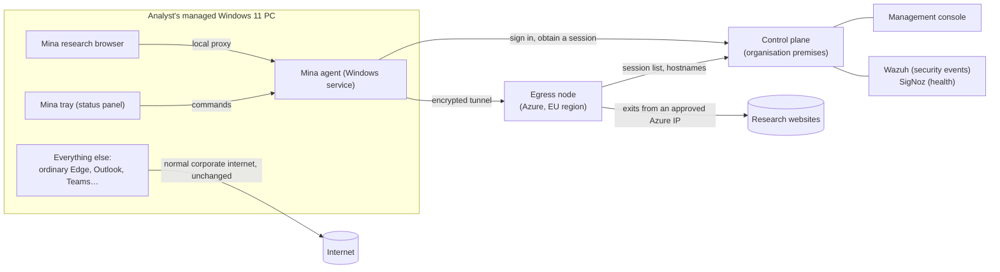

# Mina — user manual

A plain-language guide to what Mina does and how it is used and operated. It is written for
three readers: **analysts** who browse through it, **managers** who approve sensitive sessions,
and **operators** who run the platform.

This manual is informational. Where it and the authoritative documents disagree, the authoritative
documents win: `docs/REQUIREMENTS.md`, `docs/ARCHITECTURE.md`, `docs/LOGGING_AND_PRIVACY.md`,
`docs/OPERATIONS.md` and the ADRs in `docs/adr/`.

Last revised: 2026-09-05, against the state of the code and decisions on that date. Section 8 lists
what is not built yet.

---

## 1. What Mina is

Mina gives analysts a separate, governed way to browse the internet for research.

When an analyst uses the **Mina research browser**, the websites they visit see an approved
Microsoft Azure public IP address in an EU region — not the organisation's normal fixed public
addresses. Everything else on the analyst's PC (ordinary Edge, Outlook, Teams, every other
application) keeps using the normal corporate internet connection, exactly as before.

Mina provides three things:

- **Separation.** Research traffic leaves from dedicated Azure addresses that are not the
  organisation's everyday addresses.
- **Governance.** Every research session is tied to a named user, a managed device and a chosen
  region. The hostnames visited are recorded by default. A manager can approve a time-limited
  window in which hostnames are not recorded.
- **Fail closed.** If the protected path is not available, the research browser simply stops
  working. It never silently falls back to the normal corporate connection.

### What Mina is not

| Mina is not… | Because… |
|---|---|
| A VPN into the corporate network | The Azure egress nodes have no route into internal corporate networks, and never will without a separate approved decision. |
| An anonymity tool | Websites see an Azure address that belongs to the organisation's subscription, and the organisation itself records who used it, from which device, and when. |
| An open proxy | Only an authenticated session from a managed, compliant device can send traffic through it. |
| A way to inspect HTTPS content | There is no TLS interception. The platform sees the hostname of each connection, never the full URL or page content. |
| A device-wide VPN | Only the Mina research browser uses the path. Nothing else on the PC is touched. |

---

## 2. How it works, in plain terms

### The parts

| Part | Where it runs | What it does |
|---|---|---|
| **Research browser** | Analyst's PC | A second, separate installation of Microsoft Edge (Beta channel) with its own profile. It is the only program on the PC that uses Mina. |
| **Mina agent** | Analyst's PC, as a Windows service | Obtains the research session, holds the encrypted tunnel to Azure, and serves the research browser through a local proxy. It also installs the firewall rule that stops the research browser reaching anything except the agent. |
| **Mina tray** | Analyst's PC, in the notification area | Shows whether the analyst is protected, which region they exit from, and how the session is being logged. It is where the analyst starts and ends sessions, picks a region, requests a sensitive session, and opens the research browser. |
| **Control plane** | organisation premises (Proxmox cluster, DMZ network) | The API and management console plus a SQL Server database. Issues sessions, holds approvals, keeps the audit trail and the hostname telemetry. |
| **Egress nodes** | Azure, one set per approved EU region | Accept only authenticated tunnels from the agent, open the connections to the research websites, and send the traffic out from static Azure addresses. |
| **Microsoft Entra ID and Intune** | Microsoft cloud | Decide who is allowed to use Mina, and require a managed, compliant device. Analysts reuse their existing Windows sign-in; there is no separate Mina password. |
| **Azure Key Vault and immutable storage** | Azure | The vault holds the platform's certificate-signing key, which never leaves it. The storage holds write-once checkpoints of the audit trail so tampering would be detectable. |
| **Wazuh and SigNoz** | organisation premises | Wazuh receives security and audit events. SigNoz receives operational health data. Neither ever receives the hostnames analysts visited. |

### A session, step by step

1. The analyst opens the Mina tray and picks a region.
2. The tray signs the analyst in silently using their existing Windows sign-in. Entra checks that
   they hold the Analyst role and that the device is managed and compliant.
3. The agent asks the control plane for a session. The control plane checks the role, the device
   and the region, records the session, and returns a short-lived session certificate valid for
   about an hour.
4. The agent opens an encrypted tunnel to the egress node in the chosen region and starts its
   local proxy. The panel turns to **Protected**.
5. The analyst clicks **Open research browser**. The browser is launched pinned to the agent's
   proxy and can reach the internet only through it.
6. Every connection the browser makes is recorded by hostname at the egress node. The agent
   renews the session automatically before it expires, for as long as the analyst is signed in and
   still authorised.
7. The analyst clicks **End session**, or the session is ended, expired or revoked. The path
   closes and the research browser has no route out until a new session exists.

---

## 3. Who does what

| Role | Entra app role | Who | What they can do |
|---|---|---|---|
| Analyst | `Mina.Analyst` | Research analysts | Start and end sessions, choose an approved region, request a sensitive session, open the research browser. |
| Approver | `Mina.Approver` | Managers | Use the management console: see the overview, the session list and the approvals queue; approve or deny sensitive-session requests raised by others. |
| Telemetry viewer | `Mina.TelemetryViewer` | Named managers/compliance reviewers | Open the **Browsing Data** screen and review an analyst's hostname-level connection records. Deliberately a separate role from Approver: deciding a sensitive-session request and reading browsing history are different privileges. Every query is itself audited. |
| Administrator | `Mina.Admin` | Platform administrators | Reserved. Today administration is done through configuration and infrastructure code, not through the console. |
| Operator | — | Infrastructure and platform team | Deploy and run the control plane, the Azure resources and the endpoint package; handle incidents and runbooks. |

Roles are assigned through Entra security groups, never inside Mina itself.

**What an analyst needs before Mina works for them:**

- A Windows 11 PC enrolled in Intune and reporting as compliant.
- To be signed in to Windows with their organisational Entra account.
- Membership of the Entra group that carries the Analyst role.
- The Mina endpoint package installed by Intune, which brings the agent, the tray, the research
  browser configuration and a Start-menu shortcut. The research browser (Edge Beta) is installed
  by Intune as a dependency.

---

## 4. Analyst guide

### 4.1 Starting a session

The Mina tray starts automatically when you sign in to Windows. Its icon sits in the notification
area. If it is not running, open **Mina** from the Start menu.

The icon is a tunnel. Its light is on while research browsing works (**Protected**) and off while
it does not: grey while connecting or between sessions, red when the path has been lost or the
agent cannot be reached. The light never comes on for any other reason, so an unlit tunnel always
means the research browser has no route out.

Click the icon to open the panel. Choose an **Egress region** from the list and click
**Start session**. Only regions that administrators have approved and activated appear in the list.
You may occasionally see a Microsoft sign-in prompt; that is Windows re-confirming your identity and
your device, not a separate Mina password.

When the headline reads **Protected**, click **Open research browser**. That button only exists
while the path is actually up.

### 4.2 Reading the panel

| Headline | Meaning | What you can do |
|---|---|---|
| **Protected** | A session is live and research browsing exits from the region shown. | Open research browser, End session, request a sensitive session. |
| **Connecting** | The protected path is being set up. Research browsing does not work yet. | Wait, or End session. |
| **Session ended** | You ended the session. The research browser has no route out. | Start session. |
| **Browsing stopped** | The path was lost and could not be rebuilt. The agent keeps retrying and shows a countdown to the next attempt. | Retry now, End session. |
| **Agent unavailable** | The tray cannot reach the Mina agent service on this PC. | Retry. If it persists, contact IT. |

The panel also shows:

- **Egress region** — where research traffic exits from. Changing it ends the current session and
  starts a new one in the new region.
- **Logging** — `Hostnames recorded` in a normal session, `Hostnames suppressed` during an
  approved sensitive session, `No session` otherwise.
- **Session** — the first eight characters of the session ID and a countdown to the next renewal.
  Renewal is automatic; you do not need to do anything.

Closing the panel with the ✕ button hides it. Your session is not affected.

### 4.3 What the research browser is

It is a **separate Edge installation** (Edge Beta) with its own profile, history, cookies and
bookmarks. It shares nothing with your ordinary Edge. Use it only for research browsing, and use
your ordinary Edge for everything else.

The research browser can only reach the internet through Mina. If you launch it without a live
session — from a shortcut, a file association, or anything else — it will not load any page.
That is by design.

On a PC shared by more than one analyst, the research profile is shared between them. Endpoints
are expected to be assigned to one analyst each.

### 4.4 What is recorded

In a normal session the platform records:

- who you are and which device you used;
- the session ID, its start and end times, and the region you chose;
- for every connection the research browser makes: the **hostname**, port, bytes transferred and
  duration.

It does **not** record full URLs, page content, search terms, form data or anything inside HTTPS.
There is no decryption of your traffic.

Be aware that the hostname record includes connections the browser makes on its own — update
checks, safe-browsing lookups, new-tab content and similar. A hostname in the record is therefore
not proof that you deliberately visited that site.

### 4.5 Sensitive sessions

If research is sensitive enough that even hostnames should not be recorded, you can ask a manager
for a time-limited **sensitive session**.

1. In the panel, click **Request a sensitive session**.
2. Enter a **justification reference** — a case or file number, not a description of the work —
   and how many minutes you need. The default is 60. The maximum is set by policy (240 minutes
   unless configured otherwise).
3. Click **Send for approval**. The panel shows `Waiting for a manager to decide`. You can
   **Withdraw request** at any time. Only one request per session can be waiting at once.
4. When a manager approves, the panel shows `Approved by <manager> for <n> minutes · starts when
   you say so`. Nothing changes until you click **Start suppression**.
5. Once started, the logging label reads **Hostnames suppressed** and a countdown shows how long
   remains.
6. **When the window ends, the session ends with it.** The research browser loses its route.
   Start a fresh normal session if you need to continue.

What is still recorded during a sensitive session: your identity, the device, the session ID and
times, the region, the justification reference, who approved it and when, and aggregate traffic
counts. Only the hostnames are suppressed, and only for the approved window. There are no
permanent exemptions.

If the manager denies the request, the panel says so and the session continues as a normal one. An
approval you never start lapses on its own without ending your session.

### 4.6 Ending a session

Click **End session** in the panel. The tunnel closes and the research browser stops loading pages.
Closing the browser window does not itself end the session; end it from the panel when you have
finished.

### 4.7 If browsing stops

When the panel shows **Browsing stopped**, the protected path went down and could not be rebuilt
yet. The alert in the panel says the important thing: **nothing was sent through the
organisation's normal internet connection.** Research browsing paused; it did not leak.

- The agent retries automatically. **Retry now** forces an attempt.
- Do **not** continue the research in your ordinary Edge. That would expose the research from the
  organisation's normal addresses, which is exactly what Mina exists to prevent.
- If the problem persists, note what the panel says under the headline and contact IT. Common
  causes are the control plane or the egress region being unavailable, your device falling out of
  compliance, or your session having been revoked.

---

## 5. Manager guide (approvers)

The **management console** is a web application reachable only from the corporate network. Sign
in with your organisational Entra account from a compliant device. Overview, Sessions and Approvals require
the Approver role; Browsing Data requires the separate Telemetry viewer role.

| Screen | What it shows |
|---|---|
| **Overview** | Active sessions, how many are in sensitive mode, how many requests await a decision, and which approved regions are currently selectable by analysts. |
| **Sessions** | The most recent research sessions: analyst, device, region, state, logging mode and lease expiry. This is the metadata that is retained even during sensitive sessions. |
| **Approvals** | The queue of sensitive-session requests waiting for a decision. |
| **Browsing Data** | Hostname-level connection records for an analyst and date range, grouped by host, with connections outside office hours flagged once the operator has configured office hours. A sensitive session shows connection counts only, never destinations. Either name one analyst or keep the range within 90 days. Every view is written to the audit trail as `telemetry_viewed`, and there is no export. |

### Deciding a request

Each row on the Approvals screen shows when it was requested, by whom, the justification reference,
how long was asked for, and the session. To decide:

- **Approve** — optionally adjust the minutes (1 to 240) and click Approve. The analyst is told,
  and chooses when to start the window.
- **Deny** — click Deny. The analyst is told and their session continues under normal logging.

Rules the platform enforces, not just the screen:

- You cannot decide a request you raised yourself, even if you hold the Approver role.
- An approval is time-bound. When the window expires, the analyst's session is terminated rather
  than quietly resuming logging.
- Every decision is written to the audit trail and forwarded to Wazuh as a security event, with
  your identity attached.

Approving suppresses hostnames only. Everything listed at the end of section 4.5 stays recorded.

---

## 6. Operator guide

### 6.1 Where everything runs

| Location | Components |
|---|---|
| **on-premises Proxmox cluster, dedicated DMZ VLAN** | Publishing reverse proxy (nginx), application host (control-plane API and management console), SQL Server host (Azure Arc-enabled). Telemetry relay to Wazuh and SigNoz. |
| **Azure, control-plane support** | Key Vault (CA signing key, non-exportable), storage account with an immutable container (audit anchors), Log Analytics workspace and alerts on any operation touching those two resources. |
| **Azure, one egress stamp per active region** | VNet and NSG, public load balancer with one static ingress IP on TCP 443, Envoy virtual machine scale set with a .NET sidecar and the Wazuh agent, NAT Gateway with a static public IP prefix. |
| **Analyst endpoints** | The Intune Win32 package: agent service, tray, research-browser configuration, Start-menu shortcut, plus Edge Beta as an Intune dependency. |

The control-plane API has two listeners. The **node-facing** one is the only thing published to
the internet, through the DMZ proxy, and serves only the endpoints the egress nodes need. The
**corporate-facing** one carries the analyst session API, the approvals workflow and the console,
and is reachable only from corporate ranges. A request for a management endpoint arriving on the
published port gets a plain 404.

### 6.2 Environments and infrastructure code

Everything is Terraform under `infra/terraform/`:

| Environment | Target | Contains |
|---|---|---|
| `environments/dev` | Azure dev subscription | The PoC egress stamp plus the control plane's Azure support resources. |
| `environments/dev-onprem` | Proxmox | The DMZ VLAN, the proxy, application and SQL hosts, their firewalls and accounts. |
| `environments/test`, `environments/prod` | — | Scaffolded; not yet applied. Production deployment requires explicit human approval. |

Each environment README documents the values you must supply and the exact apply sequence. Never
apply destructive changes to Azure or production identity without explicit human approval.

### 6.3 Standing up an environment, in order

1. **Azure support resources and the first egress stamp** — apply `environments/dev`. Note the
   `key_vault_uri` and `audit_export_container_uri` outputs.
2. **Bootstrap the internal CA once per vault** — run the operator tool `mina-ca bootstrap`
   against the vault. The API can read the CA certificate but cannot create or replace it.
3. **Proxmox hosts** — apply `environments/dev-onprem`, then install SQL Server, onboard the hosts
   to Azure Arc, and install the TLS certificate on the proxy.
4. **Database schema** — apply the idempotent EF migration script as a deliberate step. The
   application never migrates on start-up.
5. **Application** — `scripts/deploy-control-plane-api-windows.ps1` and
   `scripts/deploy-management-ui-windows.ps1` publish and deploy the API and the console.
6. **Egress node sidecar** — `scripts/publish-sidecar.sh` builds it; the stamp's cloud-init
   installs it, pointed at the published control-plane URL.
7. **Endpoint package** — `endpoint-agent/packaging/Build-MinaEndpointPackage.ps1` publishes,
   configures, verifies, signs and wraps the Intune package. Create the Win32 app in Intune from the
   generated settings file, with Edge Beta as a required dependency, and assign it to the analyst
   device group.
8. **Entra** — the "Mina" app registration with its app roles, group assignments, the
   compliant-device Conditional Access policy, and the authentication context the control plane
   requires.

### 6.4 Settings that change behaviour

All under the `Mina` configuration section of the control-plane API unless stated.

| Setting | Meaning |
|---|---|
| `Regions:Approved` | Regions analysts may ever be offered. Changing this is a governed decision. |
| `Regions:Active` | Regions with a running egress stamp. Only these appear in the analyst's list. |
| `Egress:Regions:<region>` | Ingress host, port and TLS server name of each stamp. |
| `Session:LeaseTtl` | Session certificate lifetime. Default one hour. |
| `Session:RequiredAuthContextId` | The Conditional Access authentication context proving device compliance. Empty means compliance is enforced by Conditional Access alone. |
| `SensitiveSession:MaxDuration` | Longest suppression window an approver may grant. Default four hours. |
| `Telemetry:Retention:HostnameRetentionDays` | Age after which hostname records are deleted. **Unset means nothing is deleted**, and the API warns at every start. Production must set the ratified value. |
| `ManagementUi:OfficeHours` | `Timezone`, `Days`, `StartLocal`, `EndLocal` defining in-hours for the Browsing Data off-hours flag. **Unset means nothing is flagged**, and both the API and the console warn at every start. Partial configuration refuses to start. Decided default once set: Monday–Friday 07:00–19:00, `Europe/Malta`. Set on both the API and the console. |
| `Hosting:Listeners` | The two listener ports. A non-development host refuses to start without both. |
| `Observability:OtlpEndpoint` | Where SigNoz telemetry is sent. Unset means nothing is exported. |
| `Pki:KeyVaultUri`, `Audit:ExportContainerUri` | The two Azure resources the control plane uses. |

The egress sidecar refreshes its session list every 15 seconds and refuses every tunnel once that
list is older than 5 minutes.

### 6.5 Day-to-day operation

- **Adding a region.** Apply the stamp for an already-approved region from Terraform, add its
  ingress details under `Egress:Regions`, add it to `Regions:Active`, and assign the region's node
  app role to the stamp's managed identity. Analysts see it on their next panel refresh.
- **Disabling a region urgently.** Remove it from `Regions:Active` and, if needed, stop the
  scale set or load balancer in Azure. Sessions in that region stop being renewable and new tunnels
  are refused within the sidecar's refresh interval.
- **Revoking a session or user.** Remove the user from the Analyst group, or mark the device
  non-compliant. Renewal fails within one lease period, and the node stops admitting new tunnels for
  the session within about 15 seconds of the control plane dropping it. A tunnel that was already
  open is capped at 60 minutes.
- **Watching health.** SigNoz carries session establishment latency and failures, approval
  durations, ingest volume, the telemetry-scrub counter and the suppression-mismatch counter.
  Wazuh carries the audit and security events: authorisation denials, session lifecycle,
  approvals, tamper indicators from endpoints, and every break-glass use.
- **Verifying the audit trail.** `GET /api/audit/verify` walks the hash chain. Anchors are
  exported on a schedule to the immutable container.
- **Retention.** Proposed values are 180 days for hostname telemetry, 5 years for governance
  audit and session metadata, 90 days for operational telemetry. They require data-protection
  ratification before production.

### 6.6 What happens when things fail

| Failure | Effect on analysts | Effect on governance |
|---|---|---|
| Egress region unavailable | Research browsing in that region pauses. Panel shows Browsing stopped. Nothing falls back. | None; sessions and audit continue on the control plane. |
| Control plane unreachable from the nodes | New tunnels refused within 5 minutes; existing sessions stop renewing within an hour. | Nodes hold no governance state; check for a telemetry gap after recovery. |
| Control plane down entirely | No new sessions, no renewals, no approvals. | Audit writes stop. Verify chain integrity after recovery. |
| Key Vault unreachable | No new sessions or renewals, since certificates cannot be signed. | Audit anchoring pauses; the local chain continues and the gap must be anchored on recovery. |
| Entra unavailable | Analysts cannot sign in; existing sessions lapse within an hour. | — |
| Agent stopped or removed on an endpoint | Research browser has no route out. The firewall rule persists independently of the agent. | Intune detection reports the package missing if the rule is gone, and reinstalls. |

Every row lands on "no research traffic", never on "wrong path". `docs/RUNBOOKS.md` holds the
runbook for each, and `docs/OPERATIONS.md` the SLOs, alert catalogue and on-call handover pack.

### 6.7 Break glass

Break glass means regaining administrative control when Entra sign-in and the console are
unavailable. It is management-only, composed of standard enterprise mechanisms — Entra
emergency-access accounts and a PIM-gated Azure RBAC group for the Azure half — and every use
raises a critical Wazuh event and triggers a post-use review. There is no application backdoor, no
break-glass code in analyst components, and no path to hand-edit session or approval state.

The on-premises procedure is drafted in `docs/OPERATIONS.md` but is a proposal awaiting
ratification, not an approved mechanism.

---

## 7. Data, privacy and audit at a glance

| What | Kept where | Suppressible in a sensitive session? |
|---|---|---|
| Governance audit: sign-in outcomes, session lifecycle, approvals, admin actions, break glass | SQL audit schema, append-only and hash-chained, anchored to immutable Azure storage, forwarded to Wazuh | Never |
| Session metadata: user, device, session ID, region, timestamps, aggregate counters | SQL audit schema | Never |
| Hostname telemetry: hostname, port, bytes per connection | SQL telemetry schema, access role-restricted and itself audited | Yes |
| Full URLs, page content | **Not collected** | — |
| Operational telemetry: health, latency, capacity, scrubbed of hostnames | SigNoz | — |
| Justification references | SQL audit schema | Never |

Access to hostname telemetry is restricted and audited so that it cannot become an unsupervised
instrument against analysts. Wazuh and SigNoz never receive hostnames.

---

## 8. Current status and known gaps

As of 2026-09-05 the platform runs end to end in the development environment: a real tunnel from a
lab endpoint through the Azure dev stamp, with the control plane on a Proxmox lab standing in for
the on-premises cluster. The following are not yet done.

- **Endpoint.** The Intune package builds and signs with a lab certificate, but the app has not
  been created in Intune and the package has not been installed on a managed endpoint through
  Intune. the organisation's code-signing certificate is still to be procured. Sign-in through the Windows
  broker has not yet been exercised against a live analyst sign-in on the lab endpoint. Two of the
  four endpoint tamper indicators are not yet detected.
- **Management console.** Audit, region administration and browsing-data review screens exist.
  No other administrator screens yet. Office hours for the off-hours flag are not yet configured
  in any environment, so the flag is inert.
- **Integrations.** Delivery of events to Wazuh from the on-premises relay is not built. SigNoz
  export and scrubbing are built; dashboards are not.
- **Decisions pending.** Retention periods await data-protection ratification. Which background
  browser services the research profile disables (ADR-0007) awaits the owner and DPO. The
  on-premises break-glass procedure awaits ratification. Whether the research profile directory is
  kept or removed on uninstall is open.
- **Production.** Not deployed. Production gates include a locked immutability policy on the audit
  anchors, a diagnostics workspace in a separate subscription, Proxmox HA and SQL backup/restore,
  the runbooks in `docs/OPERATIONS.md`, a security review and penetration test, and explicit human
  approval.

`docs/BACKLOG.md` is the authoritative list.

---

## 9. Further reading

| Document | Read it for |
|---|---|
| `docs/REQUIREMENTS.md` | What the platform must and must not do. |
| `docs/ARCHITECTURE.md` | How it is built, with diagrams and the reasoning behind each control. |
| `docs/THREAT_MODEL.md` | What it defends against and what it accepts. |
| `docs/LOGGING_AND_PRIVACY.md` | Exactly what is recorded, where, and for how long. |
| `docs/OPERATIONS.md` | Runbooks, monitoring and break glass. |
| `docs/adr/` | The decisions, with their alternatives and consequences. |
| `endpoint-agent/README.md`, `edge-integration/README.md`, `endpoint-agent/packaging/README.md` | The endpoint in detail. |
| `management-ui/README.md`, `integrations/signoz/README.md` | The console and observability. |
| `infra/terraform/environments/*/README.md` | Deployment steps per environment. |
